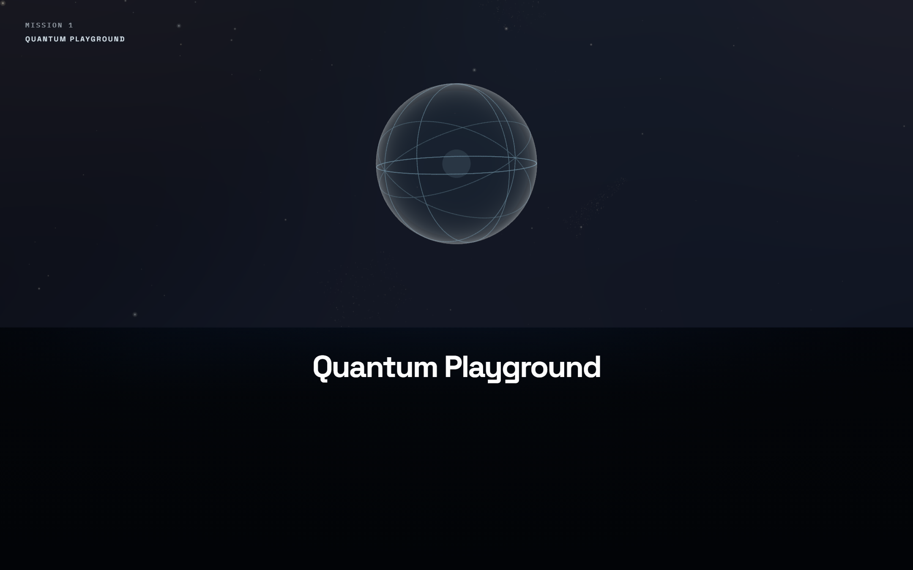
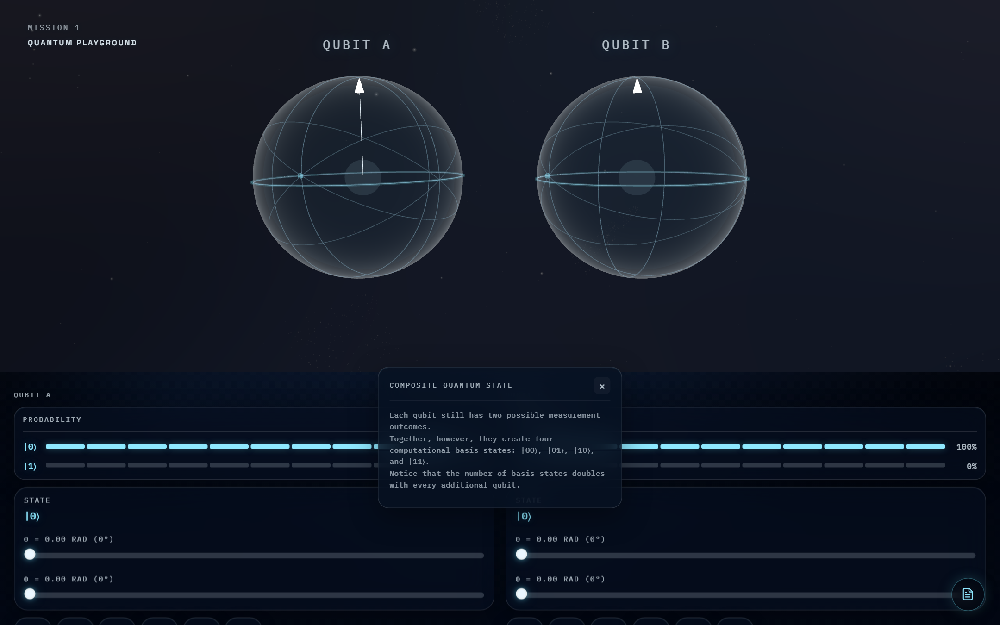
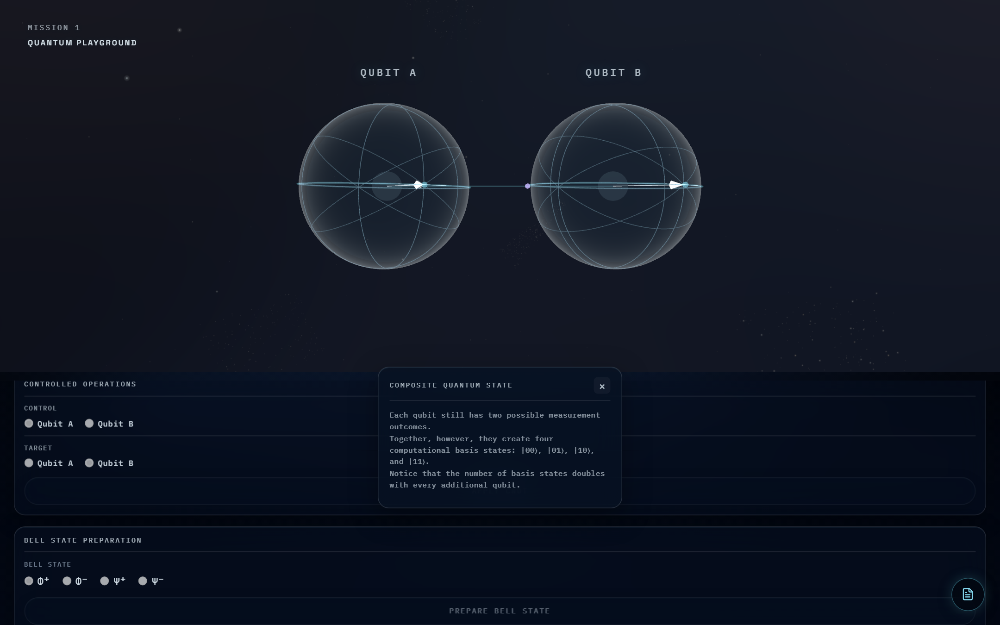

# Quantum Playground

**Learn quantum computing by seeing it, not solving it.**

An interactive educational platform that teaches quantum computing from first principles through quantum teleportation — using visual intuition instead of mathematical formalism.

<p align="center">
  
</p>

<p align="center">
  
</p>

<p align="center">
  
</p>

---

## Why Quantum Playground Exists

Most introductions to quantum computing begin with linear algebra: state vectors, unitary matrices, Dirac notation. For many learners, the mathematics becomes a wall rather than a door. They can manipulate the symbols long before they understand what the symbols describe — and many give up before that understanding ever arrives.

Quantum Playground inverts the order. It builds the intuition first, through direct interaction with quantum systems, so that when learners later encounter the formalism, it describes something they have already seen and touched.

## Educational Philosophy

**Don't tell. Show.**

Every concept in Quantum Playground is introduced through interaction and visual discovery:

- **Superposition** is not defined — it is rotated into existence on a Bloch Sphere the learner controls.
- **Measurement** is not explained as a postulate — the learner watches a state collapse and keeps a log of outcomes.
- **Entanglement** is not asserted — it is discovered through repeated experiments on Bell states.

The platform remains scientifically accurate throughout. Nothing is simplified into being wrong; it is simply made visible before it is made formal.

## What Learners Will Experience

Version 1 is a continuous journey, not a set of isolated demos. Each stage builds on the last:

- **Foundations** — Manipulate a single qubit on an interactive Bloch Sphere. Watch superposition form and probabilities update live as the state moves.
- **Measurement** — Collapse states through observation and track outcomes in an observation history, building an experimental feel for quantum randomness.
- **Single-Qubit Gates** — Apply Hadamard, X, Y, Z, S, and T gates. Every gate produces smooth animated state evolution, updated probabilities, phase visualization, and a discovery readout explaining what just happened.
- **Phase** — Observe one of quantum computing's deepest ideas made visible: probabilities can stay fixed while phase evolves. This is where quantum mechanics visibly departs from classical probability.
- **Two-Qubit Systems** — Work with two Bloch Spheres, composite states, tensor products, and controlled operations, with entanglement detection built in.
- **Bell States** — Prepare all four Bell states, observe their construction, and inspect their correlations through repeated experiment.
- **Quantum Teleportation** — The climax of Version 1: the full teleportation protocol, unfolding step by step using the gates and measurements learned along the way.
- **Bell Correlation Lab** — A concluding experimental environment. Measure Bell states repeatedly and discover their correlations yourself — through experimentation, not lecture.

## Version 1 Highlights

| Area | What it offers |
| --- | --- |
| Interactive Bloch Sphere | Real-time qubit manipulation with live probability visualization |
| Measurement | State collapse with a persistent observation history |
| Gate library | H, X, Y, Z, S, T with animated evolution and educational readouts |
| Phase visualization | Quantum phase rendered visibly — a core innovation of the platform |
| Two-qubit systems | Composite states, tensor products, controlled operations, entanglement detection |
| Bell states | Guided preparation, construction view, correlation inspection |
| Quantum teleportation | Step-by-step interactive protocol visualization |
| Bell Correlation Lab | Open-ended experimentation with Bell-state measurement statistics |

## Learning Roadmap Completed in Version 1

- [x] Bloch Sphere
- [x] Superposition
- [x] Probability
- [x] Measurement
- [x] Collapse
- [x] Observation Log
- [x] Hadamard, X, Y, Z, S, T gates
- [x] Phase Visualization
- [x] Two Qubits
- [x] Composite States
- [x] Tensor Products
- [x] Entanglement
- [x] Bell States
- [x] Bell Playground
- [x] Quantum Teleportation
- [x] Bell Correlation Lab

## Architecture Overview

Quantum Playground is a client-side single-page application. A quantum state engine maintains the mathematical state of the system (single- and two-qubit state vectors, gate application, measurement); a visualization layer renders that state as interactive 3D geometry and shader-driven effects; and an educational layer sequences the journey, surfaces explanations, and records observations.

```
Quantum state engine  →  Visualization layer (Three.js / GLSL)  →  Educational journey UI (React)
```

State changes flow one way: interactions dispatch gate applications or measurements to the engine, and the visualization animates the resulting evolution.

## Technology Stack

| Technology | Role |
| --- | --- |
| React | Application UI and educational journey |
| TypeScript | Type-safe quantum state logic |
| Three.js | 3D Bloch Sphere and state rendering |
| GLSL | Custom shaders for phase and state effects |
| Vite | Development server and build tooling |

## Local Development

```bash
# Clone the repository
git clone https://github.com/brunhild912/Quantum-Playground.git
cd Quantum-Playground

# Install dependencies
npm install

# Start the development server
npm run dev

# Build for production
npm run build
```

Requires Node.js 18+.

### Regenerating README screenshots

With the dev server running (`npm run dev`):

```bash
npx tsx scripts/capture-readme-shots.mts
```

Images are written to `docs/images/`.

## Roadmap

### Version 1.0 ✅

Bloch Sphere · Superposition · Probability · Measurement · Collapse · Observation Log · Hadamard · X · Y · Z · S · T · Phase Visualization · Two Qubits · Composite States · Tensor Products · Entanglement · Bell States · Bell Playground · Quantum Teleportation · Bell Correlation Lab

### Version 1.1 (planned)

- Better experiment analytics
- Richer Bell-state statistics
- Export experiment history

### Version 2 (vision)

Transform Quantum Playground from an educational visualizer into an interactive quantum circuit builder, where users can build, animate, replay, and experiment with their own quantum circuits.

## License

MIT
